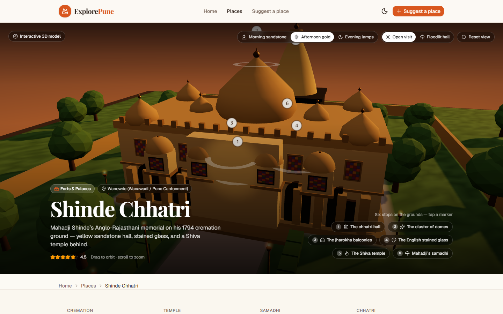

# ExplorePune

A curated city guide to Pune — forts, temples, gardens, hills and memorials — each with its own hand-built interactive 3D diorama.

Drag to orbit. Scroll to zoom. Tap a numbered stop to fly the camera. Change the light, the season, or the festival mode. Then read the story, the etiquette, and the questions people actually ask.

---

## Interactive 3D places

Every seed place has a procedural three.js model: zero imported meshes, generated at runtime, with hotspots that match the editorial feature list.

### Forts & palaces

#### Shaniwar Wada

The 18th-century seat of the Peshwas — Delhi Darwaza, ramparts, Hazari Karanje and the evening light-and-sound lawns.


#### Lal Mahal

Shivaji’s childhood home in Kasba Peth — the red palace, Jijabai’s wing, and the Shaista Khan night.


#### Sinhagad Fort

A Sahyadri hill fort: Kalyan Darwaja, Tanaji’s memorial, the trek trail, hilltop stalls and Kadelot Point.


#### Aga Khan Palace

Italianate arches, Gandhi’s internment rooms, the samadhis, and the lawns of the Gandhi National Memorial.


#### Shinde Chhatri

Mahadji Shinde’s Anglo-Rajasthani memorial in Wanowrie — yellow-sandstone chhatri hall, English stained glass, and the Shiva temple and samadhi behind.



### Museums & memorials

#### Raja Dinkar Kelkar Museum

Three floors of lamps, instruments, carved doors and the Mastani Mahal reconstruction.


#### National War Memorial Southern Command

A 25-metre column, eternal flame, Vijayanta and guns, MiG-23BN, INS Trishul, and the Command museum.


### Temples & spiritual

#### Dagdusheth Halwai Ganapati

Pune’s gold-draped Ganesh temple — mahadwar, sabha mandap, deepmalas, and Ganeshotsav night.


#### Pataleshwar Cave Temple

An 8th-century Rashtrakuta cave under JM Road — sunken court, circular Nandi, rock-cut hall and linga.


#### Parvati Hill Temple

One hundred and three steps, the Devdeveshwar cluster, and the city spread below.


#### Osho International Meditation Resort

Koregaon Park campus: welcome gate, black pyramid, Zen garden, pool and Osho Teerth.


### Nature & gardens

#### Pune–Okayama Friendship Garden

Pu La Deshpande Udyan — bridges, water channels, stone lanterns and a Korakuen-inspired plan.


#### Saras Baug

Talyatla Ganpati on the old lake-island, drained-tank lawns, the Ganesh museum, and Parvati next door.


#### Empress Garden

Thirty-nine acres in Camp: old-growth canopy, rose garden, greenhouse, and the January flower show.


### Lakes & hills

#### Vetal Tekdi

Pune’s highest hill — shrine, quarry pond, trails, and the city stacked below the ridge.


#### Khadakwasla Dam

The Mutha wall, Khadakwasla Lake, eleven radial sluices, the chowpatty promenade, and Sinhagad on the skyline.


> Desktop stills above. `docs/screenshots/<slug>-mobile.png` has the 390 px view of
> every place, and `npm run shots` regenerates the whole set.

---

## What else is here

- **Directory** — filter by category, season, audience and fee; list or map view
- **Place guides** — how to reach, tips, visitor essentials, nearby places
- **Reviews** — visitor ratings stored locally for the demo
- **Suggest a place** — community request form
- **Admin** — approve requests and moderate reviews

## Run it locally

```bash
npm install
npm run dev
```

Open [http://localhost:3000](http://localhost:3000). If port 3000 is taken, Next.js will pick the next free port (this project often lands on **3001**).

```bash
npm run typecheck
npm test
npm run build
```

## Stack

| Layer | Choice |
| --- | --- |
| App | Next.js 16 (App Router) + React 19 |
| 3D | three.js, procedural geometry, no GLBs |
| UI | Tailwind CSS 4, Base UI, lucide icons |
| Maps | Google Maps via `@vis.gl/react-google-maps` |
| Tests | Vitest on the shipped layout/anchor helpers |

Each 3D page keeps WebGL out of the server render (`next/dynamic`, `ssr: false`). Camera anchors, palettes and feature order live in pure helpers so they can be tested without a canvas.

## License

Private project — ExplorePune.
